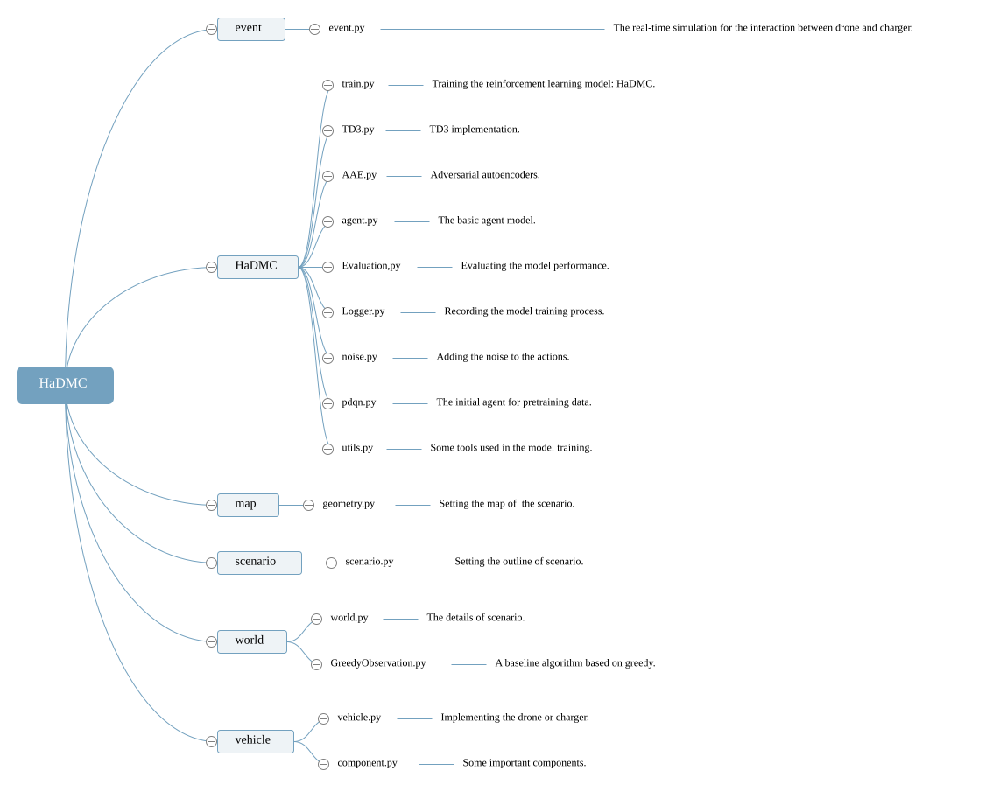
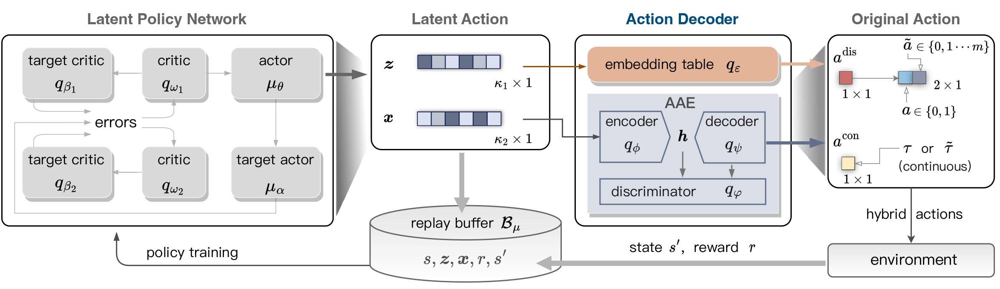

# Unmanned Aerial Vehicle and Unmanned Charging Car Cooperative Control System

## Project Overview

Firstly, this project implements the simulated interacting environment and reinforcement learning control algorithm model named HaDMC, proposed in "Scheduling Drone and Mobile Charger via Hybrid-Action Deep Reinforcement Learning". 

The paper was published in IEEE Transactions on Mobile Computing, and its link is [Scheduling Drone and Mobile Charger via Hybrid-Action Deep Reinforcement Learning | IEEE Journals & Magazine | IEEE Xplore](https://ieeexplore.ieee.org/document/10925829) .

The project facilitates collaboration between Unmanned Aerial Vehicle (UAV) and charger. The system utilizes reinforcement learning models and simulation environments to assist users in managing UAV and charger to complete observation tasks at designated locations. UAVs are extensively employed for observation in forests, oceans, and national parks. The introduction of charger offers essential charging support for UAV, significantly enhancing their endurance and operational duration, improving work efficiency, and broadening application scenarios.

## System Features

This system offers the following key functionalities:

- **Simulation Scene Generation**: Create a virtual environment that includes UAV, charger, charging points, and observation points.
- **Model Training**: Train the collaborative control strategy for UAV and charger using reinforcement learning algorithms.
- **Model Application**: Apply the trained model to real-world scenarios, enabling the UAV and charger to perform collaborative tasks.
- **Control Strategy Generation**: Generate movement strategies, observation strategies, and charging strategies for both UAV and charger.
- **Visualization Interface**: Provide a visualization interface to help users monitor and control the system's operations.

## System Requirements

- **Operating System**: Windows 7 / Windows 10 / Windows 11
- **Minimum Hardware Configuration**:
  - CPU: 2GHz or higher
  - RAM: 4GB or higher
- **Development Technologies**:
  - Programming Language: Python
  - Frameworks: Pytorch (for semantic segmentation models)

## Setup Instructions

1. **Clone the Project**:
    Clone the project repository to your local machine:

   ```bash
   git clone https://github.com/jizheDou/HaDMC.git
   ```

2. **Install Dependencies**:
    Install the required Python libraries using `pip`:

   ```bash
   pip install -r requirements.txt
   ```

3. **Run the Simulation**:
    Run the `HaDMC/train.py` script to start the model training. This will begin training the reinforcement learning model and generate the control strategies.

   ```bash
   python HaDMC/train.py
   ```

## File Structure



## Model Architecture



## Simulation Environment

The simulation environment is designed based on real-world cooperative observation scenarios involving UAV and charger. The environment includes:

- UAV
- charger
- Charging Stations
- Observation Points

The system is implemented in Python to enable coordination between UAV, charger, and other environmental elements.

## System Requirements

- **Minimum Hardware Configuration**:
  - CPU: 2GHz or higher
  - RAM: 4GB or more

## FAQ

### 1. How can I modify the simulation environment?

You can modify the simulation environment by editing the files located in the `map`, `scenario`, and `world` directories.

### 2. What should I do if I encounter an out-of-memory error during training?

Try reducing the size of the training data or consider upgrading your system's hardware configuration.

### 3. How can I view training logs?

Training logs are printed in the terminal during execution. Additionally, you can check the `logs` folder for saved log files.

## Contact

For any issues or questions, please contact the project maintainer: doujizhe@bjfu.edu.cn. 
Thank Yang Luo(luoyang@bjfu.edu.cn) for writing this document.
